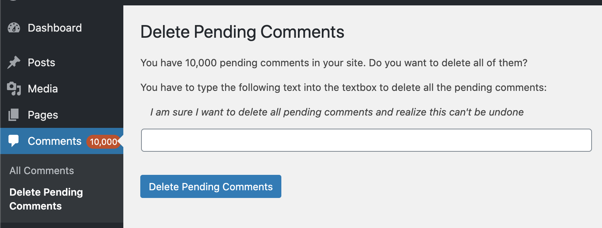
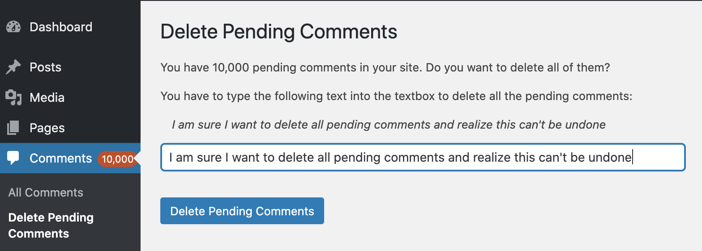
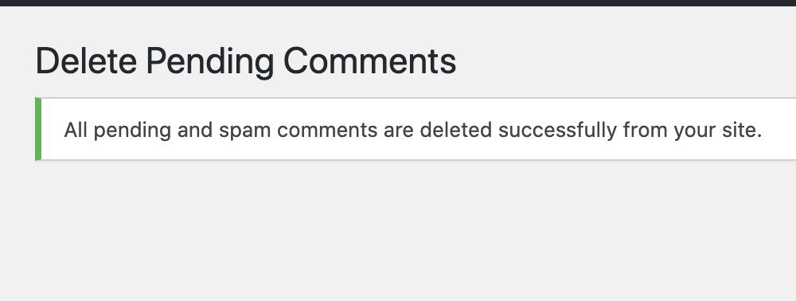

# Delete Pending Comments #
**Contributors:** sudar  
**Tags:** comments, spam, pending, delete, mass delete comments  
**Requires PHP:** 5.3  
**Requires at least:** 2.7  
**Tested up to:** 5.5  
**Stable tag:** 1.0.0  

A quick way to delete all pending and spam comments. Useful for victims of spammer attacks.

## Description ##
This plugin is a quick way to delete all pending and spam comments. It's useful for victims of spammer attacks.

After installing the plugin go to Comments -> Delete Pending Comments and follow the instructions to delete all the pending comments.

## Credits ##

This plugin was originally developed by [Nicolas Kuttler](http://www.nkuttler.de/) and he maintained it till June 24, 2020.

From June 24, 2020, [Sudar Muthu](https://sudarmuthu.com) took over the development and maintenance of the plugin.

## Installation ##
### From WordPress Admin
You can install the plugin directly from WordPress admin interface by going to Plugins -> Add New and then searching for 'Delete Pending Comments' plugin.

### Normal WordPress installations
Extract the zip file and just drop the contents in the wp-content/plugins/ directory of your WordPress installation and then activate the Plugin from Plugins page.

## Frequently Asked Questions ##

### How do I delete the pending comments?

Go to Comments -> Delete Pending Comments and follow the instructions to delete all the pending or spam comments.

### Can the plugin also delete all spam comments?

Yes, the plugin can delete both pending and spam comments.

### Is there a way to retrieve the comments that were deleted?

No. There is no way to retrieve the comments that were deleted. So please take a backup if you need to restore the deleted comments.

## Screenshots ##

Go to Comments -> Delete Pending Comments to see the list of pending comments.

Type the text that is shown to confirm the deletion of all pending comments.

The success message that is shown after the comments are deleted.

## Changelog ##
### 1.0.0 ###
 * Added support for PHP 5.3 to 7.4
 * Added support for WordPress versions upto 5.5
 * Fixed deprecation messages and warnings
 * Fixed a couple of UI issues
 * Going forward this plugin will be maintained by <a href="https://SudarMuthu.com">Sudar Muthu</a>
 
### 0.2.1.2 ###
 * Documentation update and test against 3.5
 
### 0.2.1.1 ###
 * Documentation update
 
### 0.2.1 ###
 * Manipulate the database directly. Using WordPress functions was way too slow with 10k or more pending comments.
### 0.1.1.1 ###
 * Fix version number...
### 0.1.1 ###
 * Add icon by <a href###"http://www.famfamfam.com">famfamfam</a> to the <a href###"http://planetozh.com/blog/my-projects/wordpress-admin-menu-drop-down-css/">Admin Drop Down Menu</a>.
 * Re-organize files
### 0.1.0 ###
 * Improve I18N, styling, layout, readability, add info
### 0.0.3 ###
 * More small fixes
### 0.0.2 ###
 * Small fixes
### 0.0.1 ###
 * Initial release
